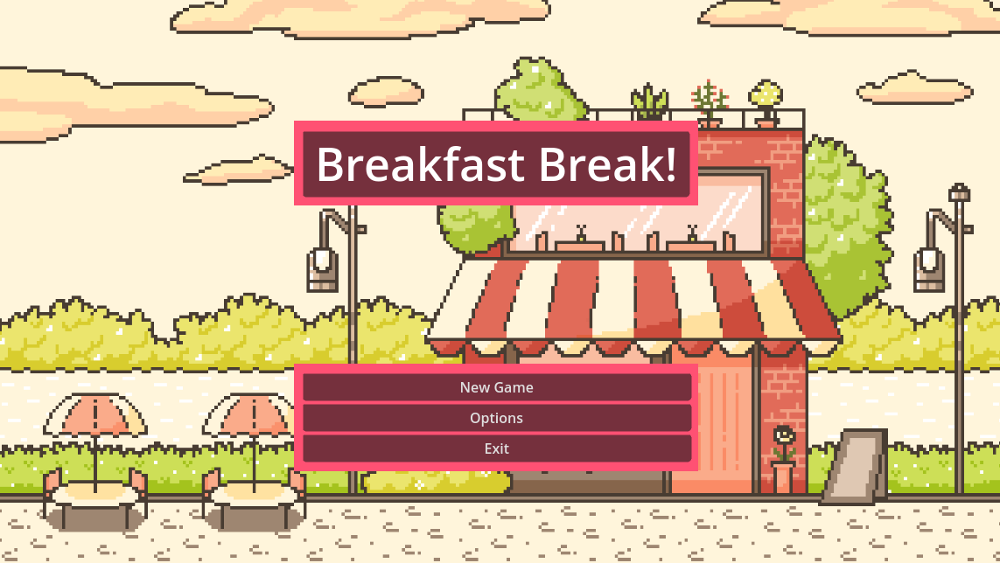

# Breakfast Breakers - A Delicious Match-3 Game

**Welcome to Breakfast Breakers!** This is a delightful match-3 puzzle game where you get to immerse yourself in a world of breakfast foods and challenging puzzles. Match three or more similar breakfast items to clear them from the board, earn points, and unlock special power-ups. It's time to satisfy your cravings for both fun and food!

## Features

- **Addictive Gameplay:** Enjoy the classic match-3 gameplay with a breakfast twist. Swipe and match various breakfast items to score points and complete levels.

- **Diverse Breakfast Foods:** From crispy bacon to fluffy pancakes, juicy fruits to nutritious cereals, encounter a wide variety of delicious breakfast foods as you progress through the game.

- **Powerful Boosters:** Unlock and use special power-ups and boosters to enhance your gameplay. Clear whole rows, columns, or areas with these tools to overcome challenging levels.

- **Challenging Levels:** Test your puzzle-solving skills with a range of levels that increase in difficulty as you advance. Strategize and plan your moves to overcome even the toughest challenges.

- **Beautiful Graphics:** Immerse yourself in a visually appealing world of breakfast foods. High-quality graphics and animations make every match a delight to experience.

- **Social Competition:** Connect with your friends and see their progress on the map. Compete for the highest scores and share your achievements on social media.

## How to Play

1. Launch the game and dive into the world of Breakfast Breakers.
2. On the game board, swipe adjacent breakfast items to match three or more of the same type.
3. Matching more than three items creates special items and power-ups.
4. Complete level objectives within a limited number of moves to progress.
5. Strategize and use boosters wisely to overcome tricky levels.
6. Keep an eye on your friends' progress and compete for the top scores.

## Installation

1. Clone or download the repository to your local machine.
2. Open the project in your preferred game development environment.
3. Build and run the game on your desired platform.

   Or visit the itch.io page to download or play in browser! [LINK HERE]

## Feedback and Contributions

We're excited to hear your feedback and suggestions for improving Breakfast Breakers. Feel free to open an issue if you encounter bugs or have ideas for new features. If you'd like to contribute to the project, please submit a pull request after forking the repository.

## Credits

- Game developed by Ben Harper, Sarah Markland & Mike Bilbee
- Graphics and animations sourced from Itch.io & Pixabay.com
- Sound effects obtained from Pixabay.com

Enjoy the breakfast bonanza and have a great time playing Breakfast Breakers!

